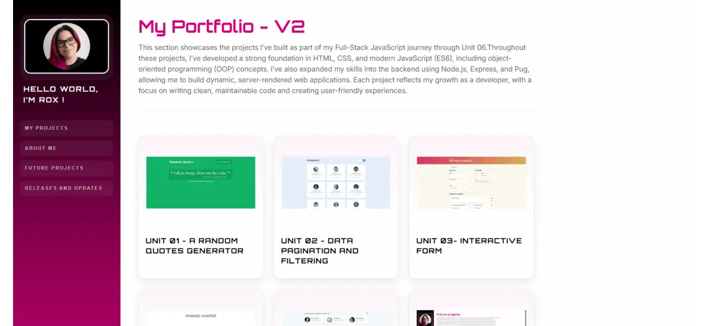

🌐 Static Node.js and Express Portfolio

Treehouse Full Stack JavaScript Techdegree – Unit 06

A dynamic portfolio site built with Node.js, Express, and Pug. This project showcases my work through reusable templates, dynamic project pages, custom routing, and error handling. It also reflects my personal visual branding with a custom magenta, black, and white theme.

🔗 Live : Coming soon

📸 Preview 📸 Preview

A responsive developer portfolio including:
- Home page with completed projects
- About page with biography, skills snapshot, and contact section
- Individual project pages
- Future projects page
- Releases and updates page
- Custom 404 and error pages

🎯 Project Requirements

Initialize a Node.js project
Install and configure Express and Pug
Create and use a `data.json` file
Set up routes for:
    -  Home (`/`)
    - About (`/about`)
- Project detail (`/projects/:id`)
Implement middleware and static file handling
Handle 404 errors and global server errors
Render project data dynamically with Pug templates

⭐ Extra Credit Features

- `npm start` configured in `package.json`
- Custom `page-not-found.pug`
- Custom `error.pug`
- Personalized styling and branding
- Additional custom pages:
    - `future_projects`
    - `releases`

✨ Personal Enhancements

To make the portfolio more personal and polished, I added:
- A custom magenta, black, and white visual identity
- Orbitron for headings and Inter for body text
- Add a skills progress bars and modify the contact information in the About page 
- Styled release cards to present future roadmap updates
- Improved project previews with cleaner image presentation
- Conditional project buttons such as `Coming soon` and `You're viewing it`

🎨 CSS Customizations

I customized the original project styling by:
- creating a branded color palette using CSS variables
- applying a magenta gradient sidebar
- changing typography for a stronger visual identity
- redesigning project cards with rounded corners, shadows, and hover effects
- styling project preview galleries with labels for desktop, tablet, and mobile
- improving responsive behavior for sidebar navigation
- adding polished button styles, disabled button states, and contact card styling
- designing custom layouts for the About and Releases pages

🧪 Testing & Code Quality

- Tested all routes and dynamic project pages
- Verified 404 and 500 error handling
- Checked responsive layouts on mobile, tablet, and desktop
- Monitored the browser console for errors
- Kept code organized, readable, and commented where useful

🧠 What I Learned

- How to build a server-rendered app with Express and Pug
- How to use route parameters to render dynamic pages
- How to structure and filter JSON data for different views
- How Express error-handling middleware works
- How to create reusable templates and layouts in Pug
- How to strengthen UI consistency with custom CSS branding and responsive design

🛠️ Tech Stack

- Node.js
- Express
- Pug
- JavaScript (ES6)
- HTML5
- CSS3

🔮 Possible Improvements

- Add animations to page sections and cards
- Refactor routes into separate files
- Refactor error handling into a separate module
- Add a real deployed live demo link for the portfolio
- Expand the Releases page into a full roadmap / changelog system
- Add project tags or filtering by technology
